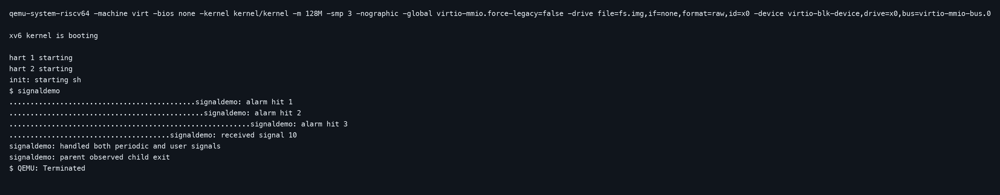
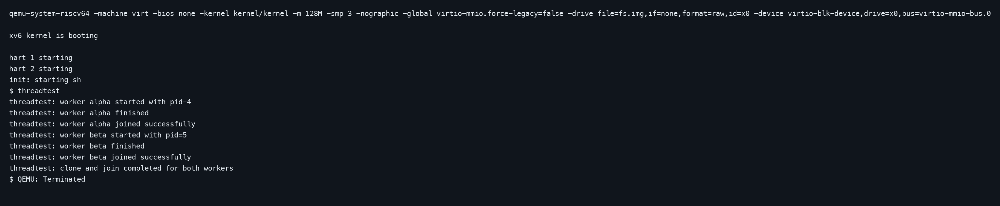
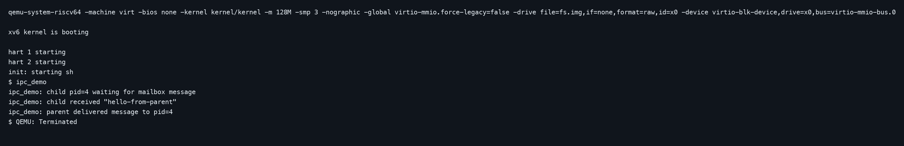
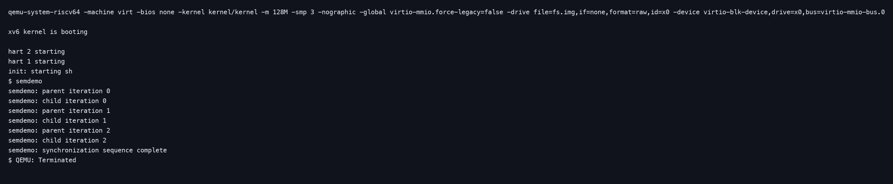
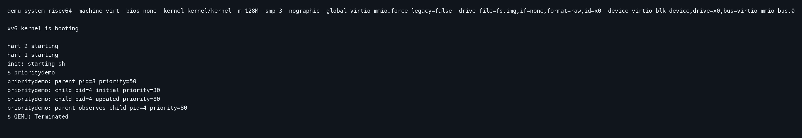
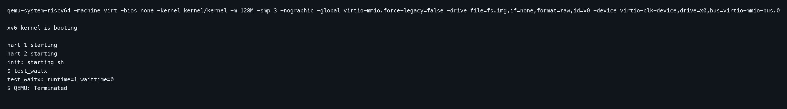
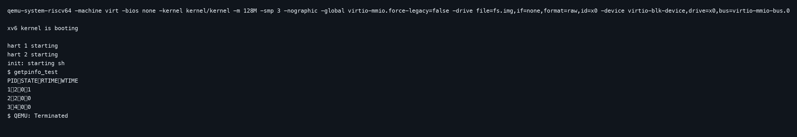

# Project 1 Report: xv6 Customize System Calls

## Objective

The objective of this project is to extend `xv6-riscv` with multiple syscall-oriented features spanning process signaling, thread-style execution, inter-process communication, synchronization, priority control, and process accounting.

## Base System Analysis

The implementation follows the standard xv6-riscv control flow:

1. User-space wrappers are declared in `user/user.h` and generated in `user/usys.S` from `user/usys.pl`.
2. Syscall numbers are defined in `kernel/syscall.h`.
3. Syscalls are dispatched in `kernel/syscall.c`.
4. Wrapper handlers in `kernel/sysproc.c` validate arguments and forward them into kernel logic.
5. Core process, signal, synchronization, and accounting behavior is implemented in `kernel/proc.c` and `kernel/trap.c`.

This structure keeps the project aligned with the xv6 syscall model while making each feature easy to trace during viva.

## Implemented Feature Groups

### 1. Signals and Alarms

- `sigalarm(int ticks, handler)`
- `sigreturn()`
- `sigsend(int pid, int signum)`

The signal subsystem extends the xv6 trap return path so a running process can be redirected to a user handler after a timer interval or after another process sends a signal.

### 2. Thread-Style Creation and Join

- `clone(void (*fn)(void *), void *stack, void *arg)`
- `join(int tid)`

This feature adds explicit worker creation and synchronization support with a dedicated join path.

### 3. Mailbox IPC

- `msgsend(int pid, char *msg)`
- `msgrecv(char *buf)`

Each process owns a simple kernel mailbox that supports message delivery and blocking receive semantics.

### 4. Semaphores

- `sem_init(int semid, int value)`
- `sem_wait(int semid)`
- `sem_post(int semid)`

The kernel semaphore table provides a compact synchronization primitive for user programs.

### 5. Priority Control

- `forkprio(int priority)`
- `setpriority(int pid, int priority)`
- `getpriority(int pid)`

These calls support controlled process creation with priority metadata and later updates or inspection.

### 6. Process Accounting

- `waitx(int *rtime, int *wtime)`
- `getpinfo(struct pinfo *info)`

The kernel tracks running, sleeping, and ready times and exposes them to user space for measurement.

## Demonstration Programs

- `signaldemo`: periodic alarm delivery and software signal reception
- `threadtest`: thread-style creation and joining
- `ipc_demo`: mailbox send/receive between parent and child
- `semdemo`: semaphore-controlled synchronization sequence
- `prioritydemo`: priority-aware process creation and updates
- `test_waitx`: runtime and waiting-time reporting
- `getpinfo_test`: process-state and timing table dump

## Files Modified

### Kernel Files

- `kernel/proc.h`
- `kernel/proc.c`
- `kernel/trap.c`
- `kernel/defs.h`
- `kernel/syscall.h`
- `kernel/syscall.c`
- `kernel/sysproc.c`

### User Files

- `user/user.h`
- `user/usys.pl`
- `user/signaldemo.c`
- `user/threadtest.c`
- `user/ipc_demo.c`
- `user/semdemo.c`
- `user/prioritydemo.c`
- `user/test_waitx.c`
- `user/getpinfo_test.c`

## Build and Demo Commands

```bash
make qemu
```

Inside the xv6 shell:

```text
signaldemo
threadtest
ipc_demo
semdemo
prioritydemo
test_waitx
getpinfo_test
```

## Additional Improvements

- timer-driven signal delivery integrated with trapframe restoration
- process accounting exported through dedicated syscalls
- mailbox IPC for readable user-level demonstration
- kernel semaphore table for synchronization experiments
- multiple demo programs to keep each functionality easy to test and explain

## Execution Screenshots

### Signal and Alarm Demonstration



### Clone and Join Demonstration



### Mailbox IPC Demonstration



### Semaphore Demonstration



### Priority Control Demonstration



### Runtime Accounting with `waitx`



### Process Table Snapshot with `getpinfo`


