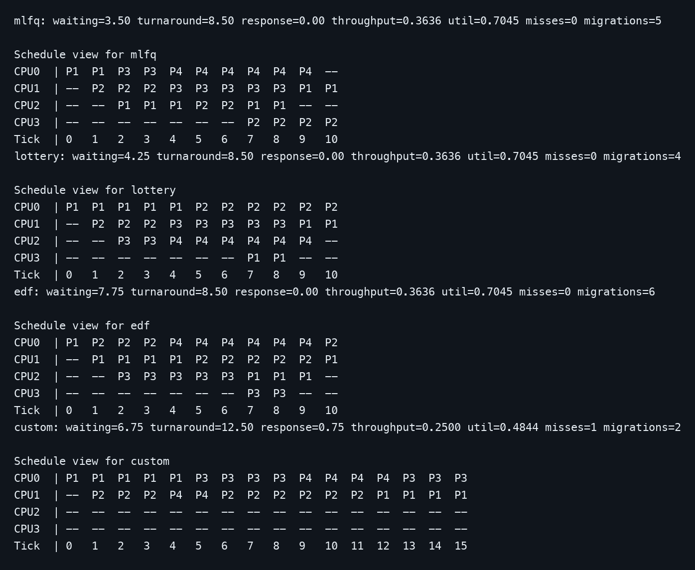
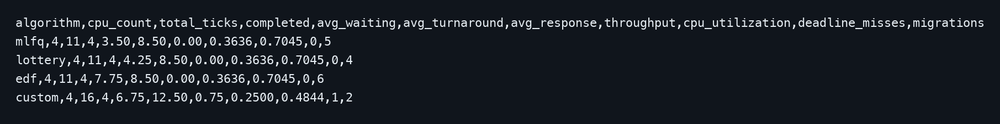
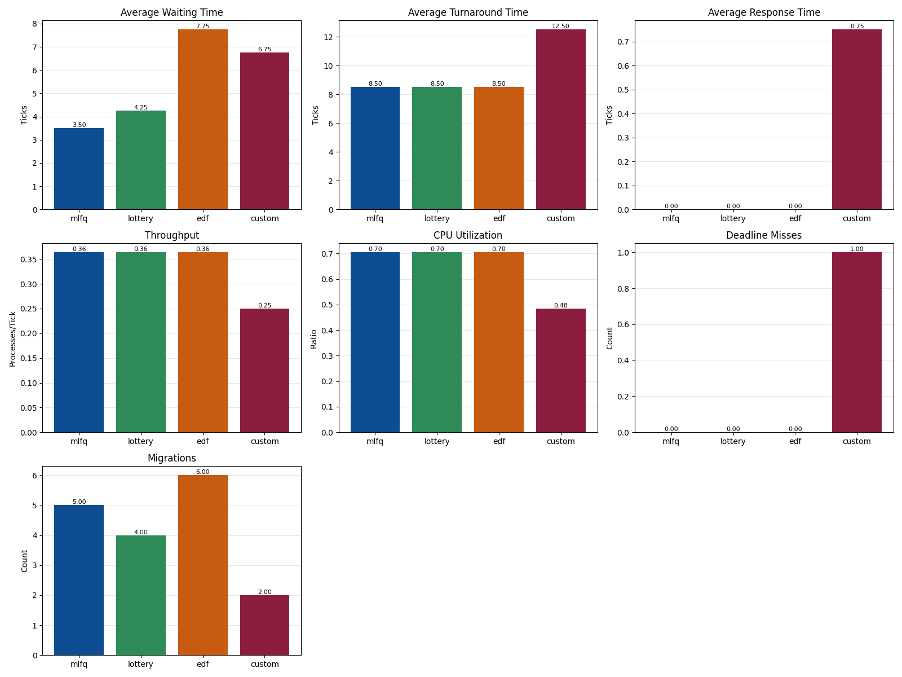
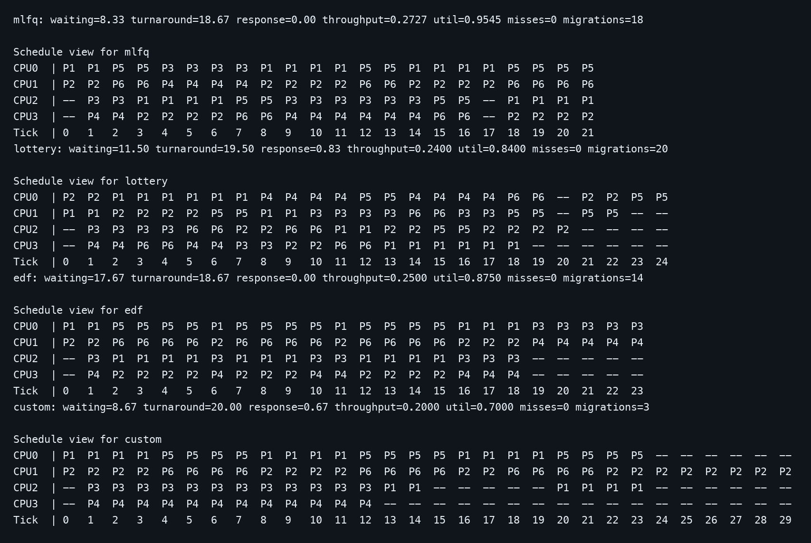
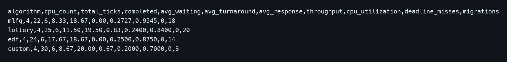
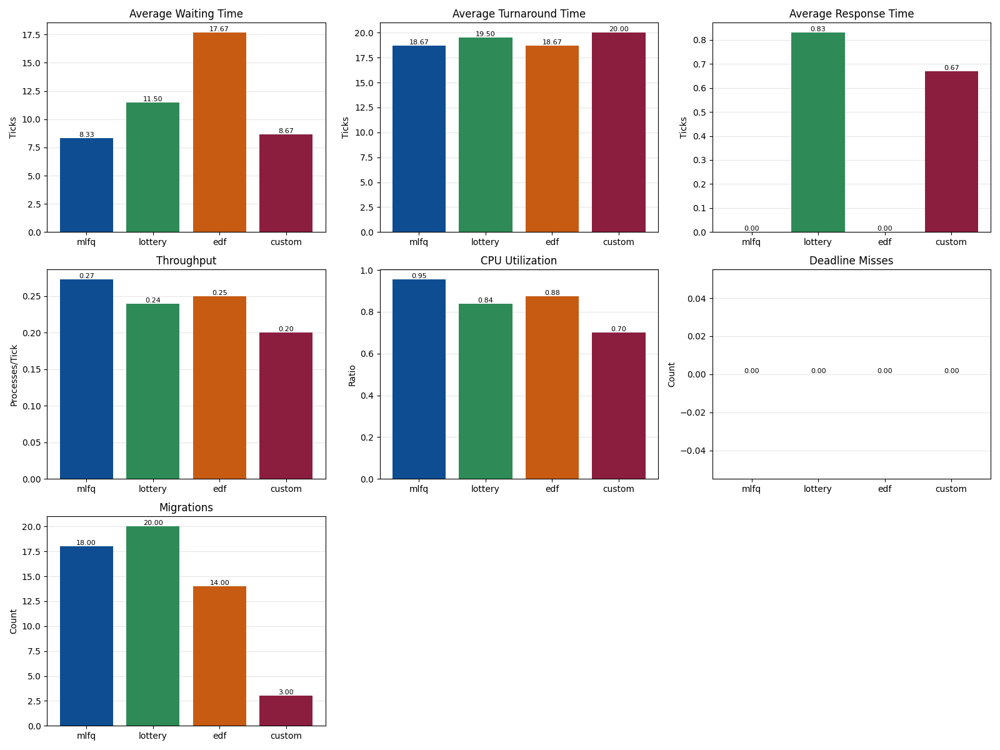

# Project 2 Report: Advanced Scheduling Algorithms

## Objective

The goal of this project is to compare advanced scheduling strategies for multiprocessor systems using a common workload-driven simulation environment. The simulator models process arrivals, alternating CPU and I/O bursts, deadlines, ticket counts, and optional CPU affinity.

## Algorithms Implemented

### 1. Multilevel Feedback Queue (MLFQ)

- three queues with progressively larger time slices
- periodic priority boost to prevent starvation
- suitable for separating interactive and CPU-bound behavior

### 2. Lottery Scheduling

- probabilistic scheduler driven by ticket counts
- deterministic seed support for repeatable experiments
- useful for fairness-oriented comparison

### 3. Earliest Deadline First (EDF)

- chooses the ready process with the nearest deadline
- records missed deadlines for result comparison
- highlights behavior under deadline pressure

### 4. Custom Scheduler

- affinity-aware multiprocessor selection
- per-CPU ready queues
- aging support to reduce starvation
- periodic work stealing
- migration counting for multiprocessor analysis

## Workloads Used

- `sample_mixed.csv`: balanced demonstration workload
- `interactive_bursty.csv`: short burst and I/O-heavy processes
- `edf_deadline_pressure.csv`: deadline-focused workload
- `lottery_ticket_skew.csv`: fairness-oriented ticket skew workload
- `multiprocessor_affinity.csv`: affinity-sensitive multiprocessor workload

## Metrics Evaluated

- average waiting time
- average turnaround time
- average response time
- throughput
- CPU utilization
- deadline misses
- process migrations

## Sample Mixed Workload Results

| Algorithm | Waiting | Turnaround | Response | Throughput | Utilization | Misses | Migrations |
| --- | ---: | ---: | ---: | ---: | ---: | ---: | ---: |
| MLFQ | 3.50 | 8.50 | 0.00 | 0.3636 | 0.7045 | 0 | 5 |
| Lottery | 4.25 | 8.50 | 0.00 | 0.3636 | 0.7045 | 0 | 4 |
| EDF | 7.75 | 8.50 | 0.00 | 0.3636 | 0.7045 | 0 | 6 |
| Custom | 6.75 | 12.50 | 0.75 | 0.2500 | 0.4844 | 1 | 2 |

Observation:
The mixed workload shows MLFQ giving the lowest waiting time, while the custom scheduler reduces migrations significantly.

## Affinity Workload Results

| Algorithm | Waiting | Turnaround | Response | Throughput | Utilization | Misses | Migrations |
| --- | ---: | ---: | ---: | ---: | ---: | ---: | ---: |
| MLFQ | 8.33 | 18.67 | 0.00 | 0.2727 | 0.9545 | 0 | 18 |
| Lottery | 11.50 | 19.50 | 0.83 | 0.2400 | 0.8400 | 0 | 20 |
| EDF | 17.67 | 18.67 | 0.00 | 0.2500 | 0.8750 | 0 | 14 |
| Custom | 8.67 | 20.00 | 0.67 | 0.2000 | 0.7000 | 0 | 3 |

Observation:
On the affinity-heavy workload, the custom scheduler sharply reduces migrations compared to the other algorithms, which is its main design objective.

## Additional Features

- one-command execution for all algorithms with `--algo all`
- CSV output for every algorithm
- graph generation for comparison
- readable ASCII schedule visualization in the terminal
- multiple workloads for behavior-focused evaluation

## Screenshots

### Terminal Schedule Output: Sample Mixed Workload

### Comparison CSV: Sample Mixed Workload

### Metric Graphs: Sample Mixed Workload

### Terminal Schedule Output: Affinity Workload

### Comparison CSV: Affinity Workload

### Metric Graphs: Affinity Workload

