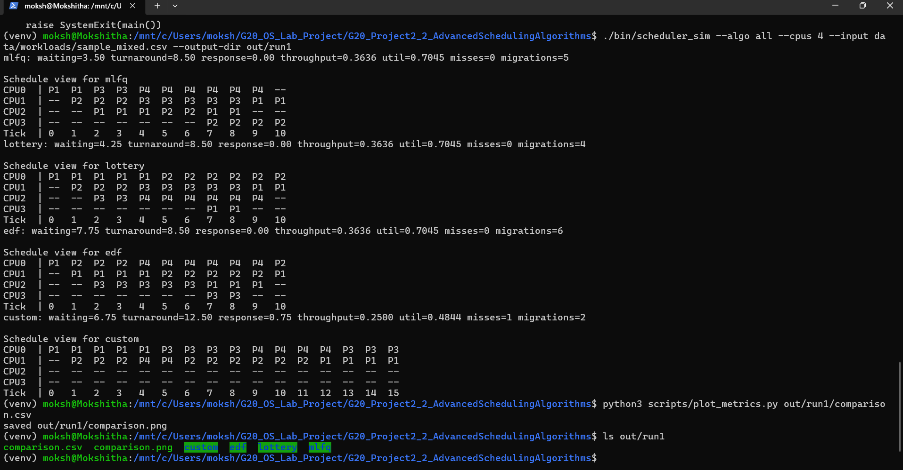
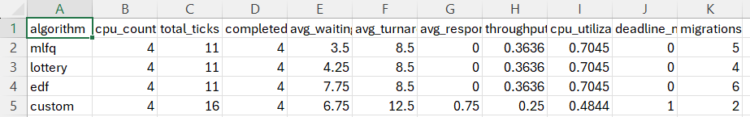
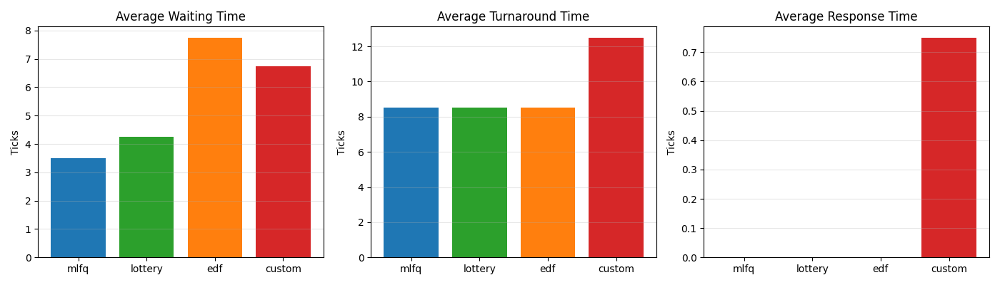

# G20 Project 2: Advanced Scheduling Algorithms

This project is a lightweight multiprocessor scheduling simulator written in C. It compares multiple policies over the same workload file and generates CSV output for later graphing.

It also prints an ASCII schedule view in the terminal so the execution order is easy to explain during viva.

## Team Members

- Sreenandan Shashidharan
- Sukrat Singh Kushwaha
- Sura Manohar Sagar
- Suraj Kumar Prajapati
- Suryansh Kulshreshtha
- T Mokshitha

## Team Split

- Sreenandan Shashidharan: simulator foundation and `custom`
- Sukrat Singh Kushwaha: `mlfq`
- Sura Manohar Sagar: `lottery`
- Suraj Kumar Prajapati: `edf`
- Suryansh Kulshreshtha: workloads and metrics validation
- T Mokshitha: plots, screenshots, and final documentation

## Supported Algorithms

- `mlfq`
- `lottery`
- `edf`
- `custom`
- `all`

## CLI

```bash
./bin/scheduler_sim --algo {mlfq,lottery,edf,custom,all} --cpus N --input <workload.csv> --output-dir <dir>
```

## Workload Format

CSV header:

```text
pid,arrival,bursts,base_priority,tickets,deadline,affinity
```

Example burst script:

```text
C5:I3:C4:I2:C6
```

- `C<number>` is a CPU burst
- `I<number>` is an I/O wait burst
- `affinity` uses `-1` for no preferred CPU

## Build

```bash
make
./bin/scheduler_sim --algo custom --cpus 4 --input data/workloads/sample_mixed.csv --output-dir out/sample_run
```

## Graphing

```bash
python3 scripts/plot_metrics.py out/sample_run/comparison.csv
```

If `matplotlib` is missing:

```bash
python3 -m pip install matplotlib
```
## Execution Flow

1. Navigate to project directory:
   cd G20_Project2_2_AdvancedSchedulingAlgorithms

2. Build the project:
   make

3. Run scheduler simulation:
   ./bin/scheduler_sim --algo all --cpus 4 --input data/workloads/sample_mixed.csv --output-dir out/run1

4. Generate performance graphs:
   python3 scripts/plot_metrics.py out/run1/comparison.csv

5. Outputs generated:
   - CSV file: out/run1/comparison.csv
   - Graph: out/run1/comparison.png

## Observations

- MLFQ has the lowest average waiting time (~3.5), making it most responsive.
- Lottery scheduling performs slightly worse but maintains fairness.
- EDF has higher waiting time (~7.75) as it prioritizes deadlines.
- Custom algorithm shows highest turnaround time (~12.5), indicating lower efficiency.
- CPU utilization is highest (~0.70) for MLFQ, Lottery, and EDF, while Custom is lower (~0.48).

## Screenshots

### Terminal Execution


### CSV Output


### Graph Output
